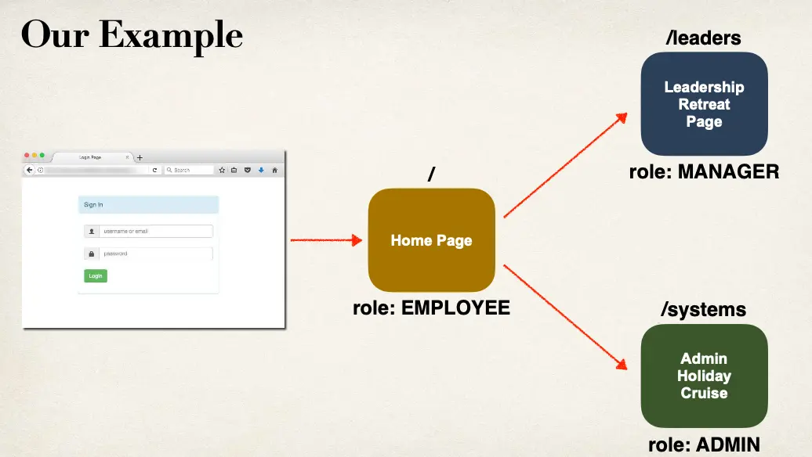

# Spring MVC Security - Demo

## Recap of our Game Plan

- Secure Spring MVC Web Apps
- Develop login pages (default and custom)
- Define users and roles with simple authentication
- Protect URLs based on role
- Hide/show content based on role
- Store users, passwords and roles in DB (plain-text -> encrypted)

