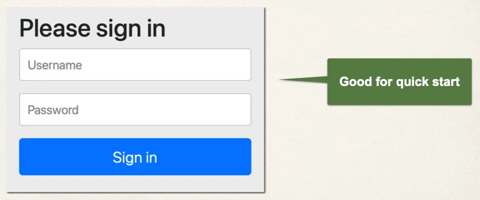
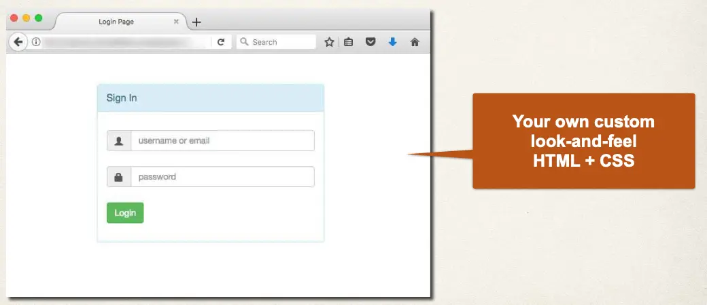

# Spring MVC Security - Custom Login Form - Overview - Part 1

## Spring Security - Default Login Form



## Your Own Custom Login Form



## Development Process

1. Modify Spring Security Configuration to reference custom login form
2. Develop a Controller to show the custom login form
3. Create custom login form
   - HTML (CSS optional)

## Step 1: Modify Spring Security Configuration

File: `DemoSecurityConfig.java`

```java
@Bean
public SecurityFilterChain filterChain(HttpSecurity http) throws Exception {
    // Configure security of web paths in application, login, logout etc
    http.authorizeHttpRequests(configurer ->
            configurer
                .anyRequest().authenticated()  // Any request to the app must be authenticated (ie logged in)
        )
        .formLogin(form ->                     // We are customizing the form login process
            form
                .loginPage("/showMyLoginPage") // Show our custom form at the request mapping `/showMyLoginPage`
                .loginProcessingUrl("/authenticateTheUser") // Login form should POST data to this URL for processing
                .permitAll()                   // Allow everyone to see login page. No need to be logged in.
        );

    return http.build();
}
```

We are using `/showMyLoginPage` and `/authenticateTheUser` for this example, but we could use any other mapping that we want to

- What we need to do: Create a controller for the request mapping `/showMyLoginPage`
- No controller request mapping is required for `/authenticateTheUser`. We get this for free :-)

## Step 2: Develop a Controller to show the custom login form

File: `LoginController.java`:

- Will return the view in `src/main/resources/templates/plain-login.html`

```java
@Controller
public class LoginController {

    @GetMapping("/showMyLoginPage")
    public String showMyLoginPage() {
        return "plain-login";
    }
}
```
