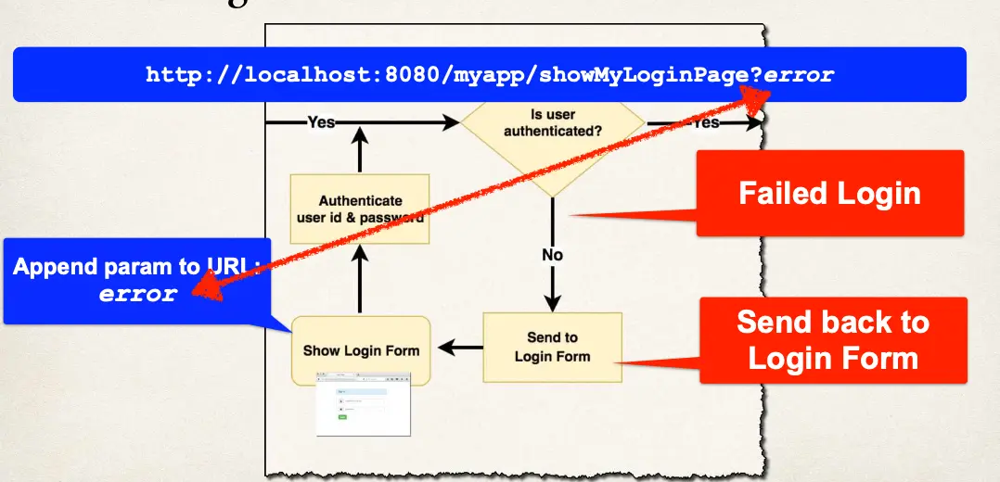

# Spring MVC Security - Login Form Error Message - Overview

- No error message for failed login - What???
- We need an error message … ASAP!!!

## Failed Login

When login fails, by default Spring Security will …

- Send user back to your login page
- Append an error parameter: `?error`



## Development Process

1. Modify custom login form
   1. Check the error parameter
   2. If error parameter exists, show an error message

## Step 1: Modify form - check for error

```html
<form>
  <!-- If error param then show message-->
  <div th:if="${param.error}">
    <i>Sorry! You entered invalid username/password.</i>
  </div>

  User name: <input type="text" name="username" /> Password:
  <input type="password" name="password" />
</form>
```
