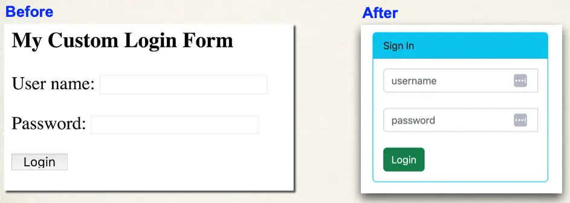

# Spring MVC Security - Custom Login Form with Bootstrap - Overview

## Let’s Make our Login Form Beautiful

## Bootstrap

- Bootstrap is a web framework that includes CSS styles and JavaScript
- Focused on front-end UI
- For our project, you do not need any experience with Bootstrap :-)

## Our Game Plan

- The instructor's friend, Alan, has helped us out
  - He created an HTML login form using Bootstrap
- We’ll modify the form to use Spring Security for our project

## Development Process

1. Modify form to point to our login processing URL
2. Verify form fields for username and password
3. Change our controller to use our new Bootstrap login form

## Bootstrap Tutorials and Docs

There are tons of free tutorials online: “bootstrap tutorial”

- https://www.w3schools.com/bootstrap

Bootstrap Official Documentation

- https://www.getbootstrap.com/docs
