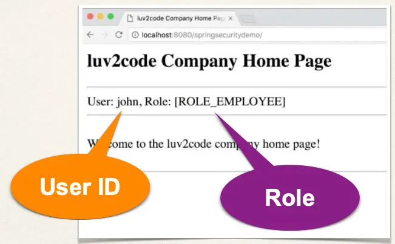

# Spring MVC Security - Display User ID and Roles - Overview

## Display User ID and Roles



## Spring Security

- Spring Security provides support for accessing user id and roles

## Development Process

1. Display User ID
2. Display User Roles

## Step 1: Display User ID

File: `home.html`

```html
User: <span sec:authentication="principal.username"></span>
```

## Step 2: Display User Roles

File: `home.html`

```
Role(s): <span sec:authentication="principal.authorities"></span>
```
