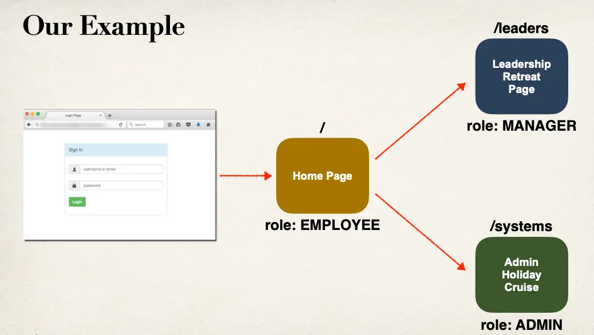
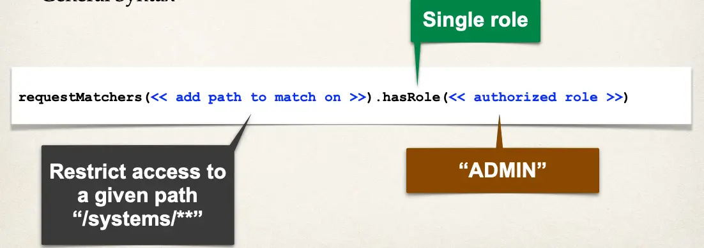
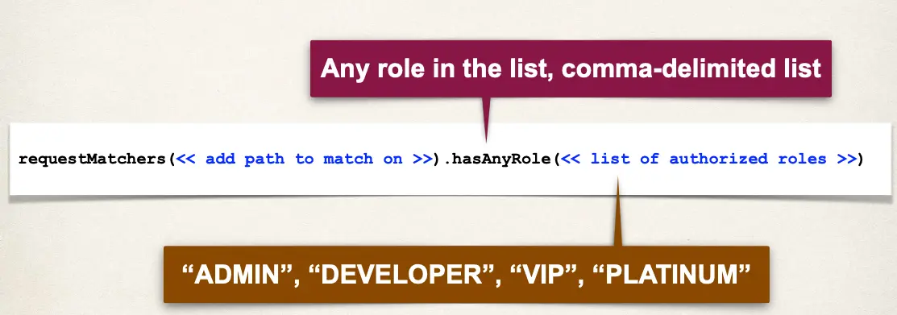

# Spring MVC Security - Restrict URLs Based on Roles - Overview



## Development Process

1. Create supporting controller code and view pages
2. Restrict Access based on Roles

## Step 1: Create Supporting Controller code and View Pages

- We'll cover this in the video

## Step 2: Restricting Access to Roles

- Update your Spring Security Java configuration file (.java)

General Syntax:



## Step 3: Restricting Access to Roles



Restrict Path to EMPLOYEE:

```java
requestMatchers("/").hasRole("EMPLOYEE")
```

Restrict Path `/leaders` to MANAGER

- Match on path: `/leaders` And all sub-directories (`**`)

```java
requestMatchers("/leaders/**").hasRole("MANAGER")
```

Restrict Path `/systems` to ADMIN

```java
requestMatchers("/systems/**").hasRole("ADMIN")
```

## Pull It Together

```java
@Bean
public SecurityFilterChain filterChain(HttpSecurity http) throws Exception {

    http.authorizeHttpRequests(configurer ->
            configurer
                .requestMatchers("/").hasRole("EMPLOYEE")
                .requestMatchers("/leaders/**").hasRole("MANAGER")
                .requestMatchers("/systems/**").hasRole("ADMIN")
                .anyRequest().authenticated()
    )

    // ...
}
```
