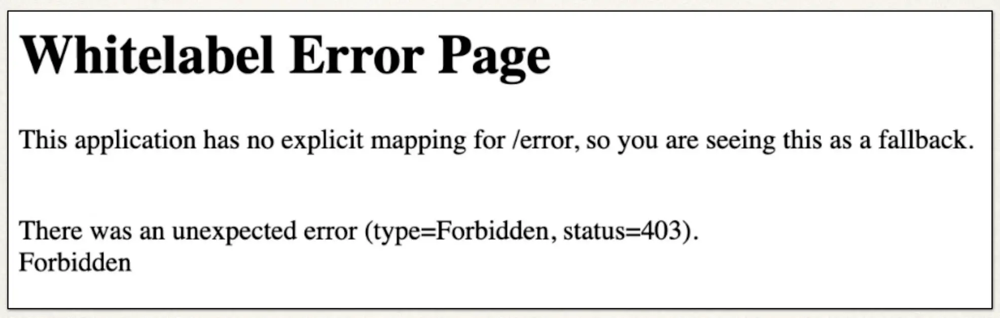
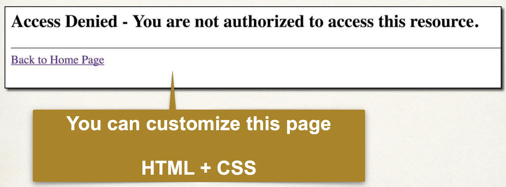

# Spring MVC Security - Custom Access Denied Page - Overview

## Default Access Denied Page



## Custom Access Denied Page



## Development Process

1. Configure custom page for access denied
2. Create supporting controller code and view page

## Step 1: Configure custom page access denied

```java
@Bean
public SecurityFilterChain filterChain(HttpSecurity http) throws Exception {

    http.authorizeHttpRequests(configurer ->
            configurer
                .requestMatchers("/").hasRole("EMPLOYEE")
                ...
        )
        .exceptionHandling(configurer ->
            configurer
                .accessDeniedPage("/access-denied")
        );
    ...
}
```

## Step 2: Create Supporting Controller code and View Page

- Cover these steps in the video
