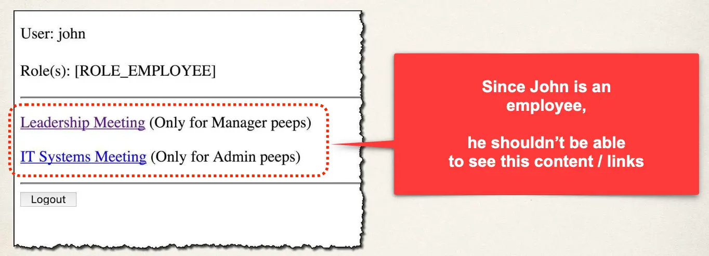
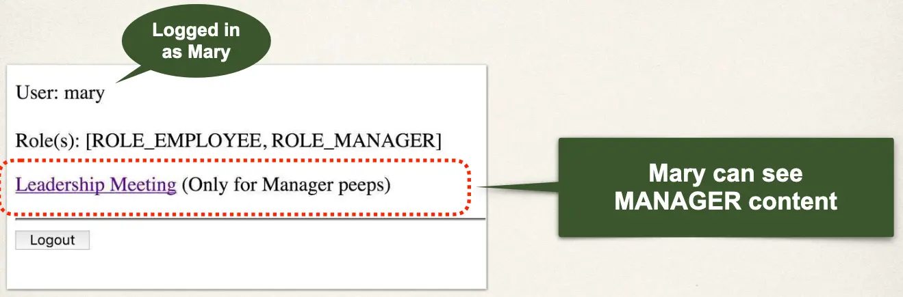

# Spring MVC Security - Display Content Based on Roles - Overview

## Why Show These Links?



## Display Content Based on Roles



## Spring Security

Only show this section for users with MANAGER role:

- If not manager, content not included in final generated HTML

```html
<div sec:authorize="hasRole('MANAGER')">
  <p>
    <a th:href="@{/leaders}"> Leadership Meeting </a>
  </p>
  (Only for Manager peeps)
</div>
```

Only show this section for users with ADMIN role

```html
<div sec:authorize="hasRole('ADMIN')">
  <p>
    <a th:href="@{/systems}"> IT Systems Meeting </a>
    (Only for Admin peeps)
  </p>
</div>
```
