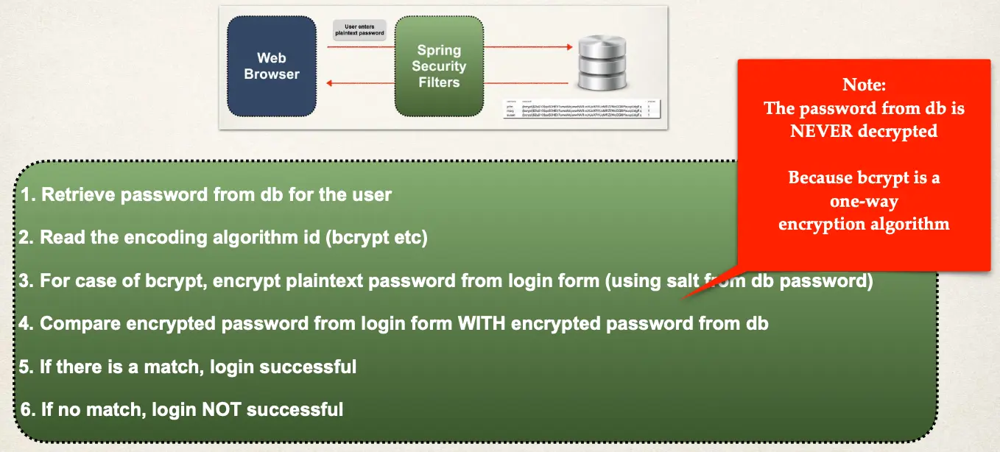

# Spring MVC Security - JDBC Authentication - BCrypt Encryption - Overview - Part 2

## Development Process

1. Run SQL Script that contains encrypted passwords
   - Modify DDL for password field, length should be 68

THAT’S IT … no need to change Java source code :-)

## Spring Security Password Storage

- In Spring Security, passwords are stored using a specific format

```
{bcrypt}encodedPassword
```

In the DB, Password column must be at least 68 chars wide:

```
{bcrypt} - 8 chars
encodedPassword - 60 chars
```

### Modify DDL for Password Field

```sql
CREATE TABLE `users` (
`username` varchar(50) NOT NULL,
`password` char(68) NOT NULL,
`enabled` tinyint NOT NULL,

PRIMARY KEY (`username`)

) ENGINE=InnoDB DEFAULT CHARSET=latin1;
```

## Step 1: Develop SQL Script to setup database tables

```sql
INSERT INTO `users`
VALUES
('john','{bcrypt}$2a$10$qeS0HEh7urweMojsnwNAR.vcXJeXR1UcMRZ2WcGQl9YeuspUdgF.q',1),
('mary','{bcrypt}$2a$04$eFytJDGtjbThXa80FyOOBuFdK2IwjyWefYkMpiBEFlpBwDH.5PM0K',1),
('susan','{bcrypt}$2a$04$eFytJDGtjbThXa80FyOOBuFdK2IwjyWefYkMpiBEFlpBwDH.5PM0K',1);
```

## Spring Security Login Process


