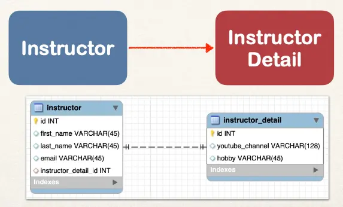
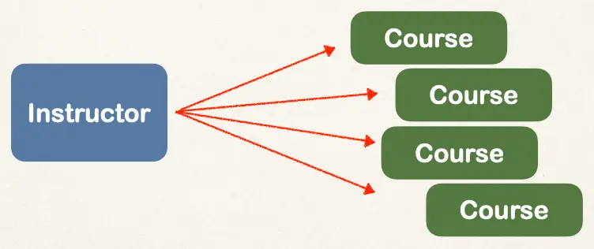

# JPA/Hibernate Advanced Mappings Overview - Part 1

## Advanced Mappings

In the database, you most likely will have

- Multiple Tables
- Relationships between Tables

We'll look at:

- One-to-One
- One-to-Many, Many-to-One
- Many-to-Many

## One-to-One Mapping

An instructor can have an “instructor detail” entity

- Similar to an “instructor profile”

## One-to-Many Mapping

- An instructor can have many courses

## Many-to-Many Mapping

- A course can have many students
- A student can have many courses

