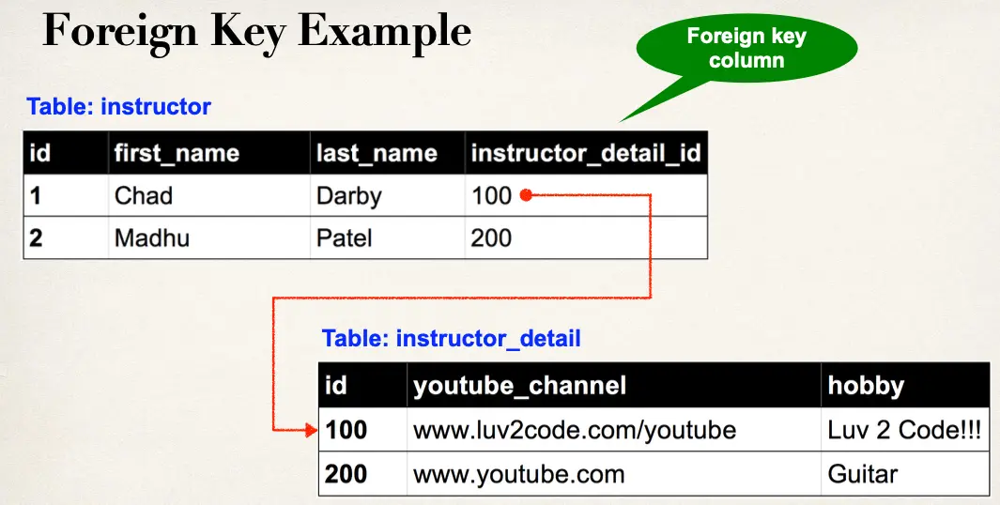
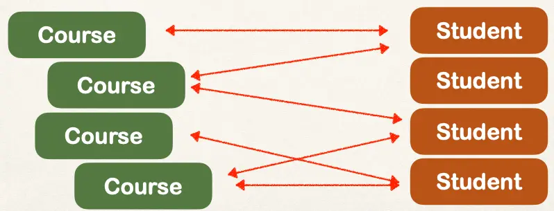

# JPA/Hibernate Advanced Mappings Overview - Part 1

## Important Database Concepts

- Primary key and foreign key
- Cascade

### Primary Key and Foreign Key

- Primary key: identify a unique row in a table
- Foreign key:
  - Link tables together
  - a field in one table that refers to primary key in another table

### Cascade

- You can cascade operations
- Apply the same operation to related entities

If we delete an instructor, we should also delete their instructor_detail

- This is known as `CASCADE DELETE`

Cascade delete depends on the use case

- Should we do cascade delete here??? No way!
  - We should remove the student from the course, but we should not delete the course
- Developer can configure cascading

## Fetch Types: Eager vs Lazy Loading

When we fetch / retrieve data, should we retrieve EVERYTHING?

- Eager will retrieve everything
- Lazy will retrieve on request

### Uni-Directional

Load the instructor, then load the instructor detail

### Bi-Directional

- You can load the instructor, then load the instructor detail, or
- You can load the instructor detail, then load the instructor

## Multiple Valid Designs

- For JPA/Hibernate relationships, there isn’t one _right_ mapping
- JPA/Hibernate supports several ways to model
  - `@OneToOne`,` @OneToMany`/`@ManyToOne` and `@ManyToMany`
- You may find other solutions online with different approaches

In this course,

- Treat the examples as a general guide
- Adapt when your application requirements and domain needs differ
