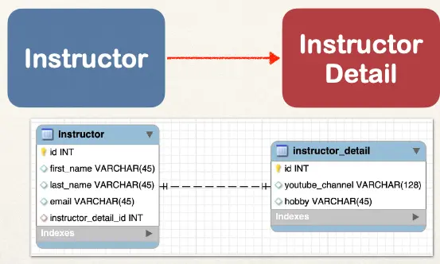

# @OneToOne Mapping Overview - Part 1

## One-to-One Mapping

- An instructor can have an “instructor detail” entity
- Similar to an “instructor profile”
- This example will be uni-directional



## Development Process: One-to-One

1. Prep Work - Define database tables
2. Create InstructorDetail class
3. Create Instructor class
4. Create Main App

### table: `instructor_detail`

File: `create-db.sql`

```SQL
CREATE TABLE `instructor_detail` (
  `id` int(11) NOT NULL AUTO_INCREMENT,
  `youtube_channel` varchar(128) DEFAULT NULL,
  `hobby` varchar(45) DEFAULT NULL,

  PRIMARY KEY (`id`)
);
```

### table: `instructor`

File: `create-db.sql`

```sql
CREATE TABLE `instructor` (
  `id` int(11) NOT NULL AUTO_INCREMENT,
  `first_name` varchar(45) DEFAULT NULL,
  `last_name` varchar(45) DEFAULT NULL,
  `email` varchar(45) DEFAULT NULL,
  `instructor_detail_id` int(11) DEFAULT NULL,

  PRIMARY KEY (`id`)
);
```

## Foreign Key

- Link tables together
- A field in one table that refers to primary key in another table

```sql
CREATE TABLE `instructor` (
  `id` int(11) NOT NULL AUTO_INCREMENT,
  `first_name` varchar(45) DEFAULT NULL,
  `last_name` varchar(45) DEFAULT NULL,
  `email` varchar(45) DEFAULT NULL,
  `instructor_detail_id` int(11) DEFAULT NULL,

  PRIMARY KEY (`id`)

  CONSTRAINT `FK_DETAIL` FOREIGN KEY (`instructor_detail_id`)
  REFERENCES `instructor_detail` (`id`)
);
```

## More on Foreign Key

- Main purpose is to preserve relationship between tables
  - Referential Integrity
- Prevents operations that would destroy relationship
- Ensures only valid data is inserted into the foreign key column
  - Can only contain valid reference to primary key in other table
