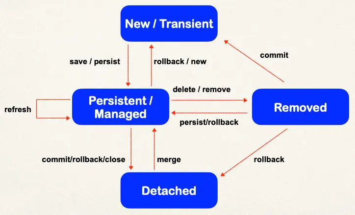

# @OneToOne Mapping Overview - Part 2

## Development Process: One-to-One

1. Prep Work - Define database tables
2. Create InstructorDetail class
3. Create Instructor class
4. Create Main App

### Step 2: Create InstructorDetail class

```java
@Entity
@Table(name="instructor_detail")
public class InstructorDetail {
  @Id
  @GeneratedValue(strategy=GenerationType.IDENTITY)
  @Column(name="id")
  private int id;

  @Column(name="youtube_channel")
  private String youtubeChannel;

  @Column(name="hobby")
  private String hobby;

  // constructors
  // getters / setters
}
```

### Step 3: Create Instructor class

```java
Step 3: Create Instructor class
@Entity
@Table(name="instructor")
public class Instructor {
  @Id
  @GeneratedValue(strategy=GenerationType.IDENTITY)
  @Column(name="id")
  private int id;

  @Column(name="first_name")
  private String firstName;

  @Column(name="last_name")
  private String lastName;

  @Column(name="email")
  private String email;

  @OneToOne
  @JoinColumn(name="instructor_detail_id")
  private InstructorDetail instructorDetail;

  // …
  // constructors, getters / setters
}
```

## Entity Lifecycle

| Operations | Description                                                                        |
| ---------- | ---------------------------------------------------------------------------------- |
| Detach     | If entity is detached, it is not associated with a Hibernate session               |
| Merge      | If instance is detached from session, then merge will reattach to session          |
| Persist    | Transitions new instances to managed state. Next flush / commit will save in db.   |
| Remove     | Transitions managed entity to be removed. Next flush / commit will delete from db. |
| Refresh    | Reload / synch object with data from db. Prevents stale data                       |

## Entity Lifecycle - session method calls



## Cascade

- Recall: You can cascade operations
- Apply the same operation to related entities

On save the instructor, also save the instructor detail


