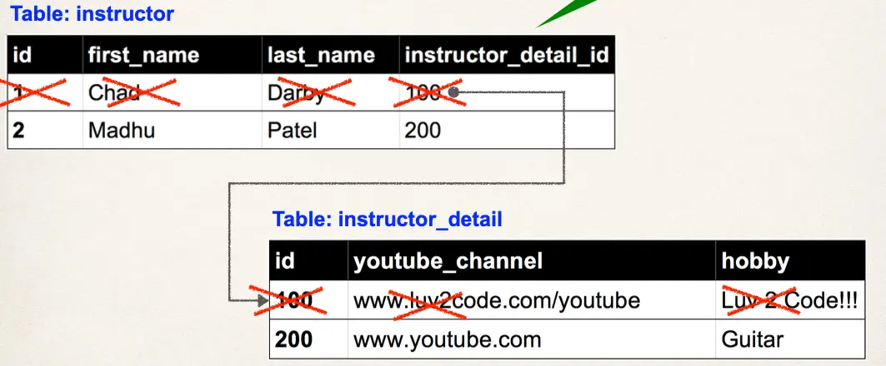
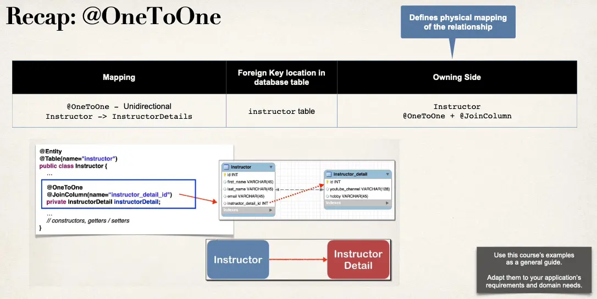

# @OneToOne Mapping Overview - Part 3

## Cascade Delete

On delete the instructor, also delete the instructor detail



## @OneToOne - Cascade Types

| Cascade Type | Description                                                                                  |
| ------------ | -------------------------------------------------------------------------------------------- |
| PERSIST      | If entity is persisted / saved, related entity will also be persisted                        |
| REMOVE       | If entity is removed / deleted, related entity will also be deleted                          |
| REFRESH      | If entity is refreshed, related entity will also be refreshed                                |
| DETACH       | If entity is detached (not associated w/ session), then related entity will also be detached |
| MERGE        | If entity is merged, then related entity will also be merged                                 |
| ALL          | All of above cascade types                                                                   |

## Configure Cascade Type

- By default, no operations are cascaded.

```java
@Entity
@Table(name="instructor")
public class Instructor {
  // …
  @OneToOne(cascade=CascadeType.ALL)
  @JoinColumn(name="instructor_detail_id")
  private InstructorDetail instructorDetail;
  // …
  // constructors, getters / setters
}
```

## Configure Multiple Cascade Types

```java
@OneToOne(cascade={CascadeType.DETACH,
                   CascadeType.MERGE,
                   CascadeType.PERSIST,
                   CascadeType.REFRESH,
                   CascadeType.REMOVE})
```

## Step 4 - Creating Spring Boot - Command Line App

We will create a Spring Boot - Command Line App

- This will allow us to focus on JPA / Hibernate
- Leverage our DAO pattern as in previous videos

## Define DAO interface

```java
import com.luv2code.cruddemo.entity.Instructor;

public interface AppDAO {
  void save(Instructor theInstructor);
}
```

## Define DAO Implementation

```java
import com.luv2code.cruddemo.entity.Instructor;
import jakarta.persistence.EntityManager;
import org.springframework.beans.factory.annotation.Autowired;
import org.springframework.stereotype.Repository;
import org.springframework.transaction.annotation.Transactional;

@Repository
public class AppDAOImpl implements AppDAO {

  // define field for entity manager
  private EntityManager entityManager;

  // inject entity manager using constructor injection
  @Autowired
  public AppDAOImpl(EntityManager entityManager) {
    this.entityManager = entityManager;
  }

  @Override
  @Transactional
  public void save(Instructor theInstructor) {
    // This will ALSO save the details object Because of CascadeType.ALL
    entityManager.persist(theInstructor);
  }
}
```

## Update `main` app

```java
@SpringBootApplication
public class MainApplication {

    public static void main(String[] args) {
        SpringApplication.run(MainApplication.class, args);
    }

    @Bean
    public CommandLineRunner commandLineRunner(AppDAO appDAO) {
        return runner -> {

            createInstructor(appDAO);
        };
    }

    private void createInstructor(AppDAO appDAO) {
      // create the instructor
      Instructor tempInstructor =
          new Instructor("Chad", "Darby", "darby@luv2code.com");

      // create the instructor detail
      InstructorDetail tempInstructorDetail =
          new InstructorDetail(
              "http://www.luv2code.com/youtube",
              "Luv 2 code!!!");

      // associate the objects
      tempInstructor.setInstructorDetail(tempInstructorDetail);

      // save the instructor
      System.out.println("Saving instructor: " + tempInstructor);
      appDAO.save(tempInstructor);

      System.out.println("Done!");
  }
}
```

Remember: `appDAO.save(...)` will ALSO save the details object

- Because of `CascadeType.ALL`
- In AppDAO, delegated to `entityManager.persist(…)`

## Recap: @OneToOne


