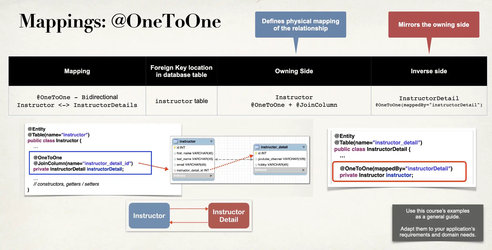

# @OneToOne Mapping - Bi-Directional Overview

## One-to-One Mapping

- We currently have a uni-directional mapping


## New Use Case

- If we load an InstructorDetail
  - Then we’d like to get the associated Instructor
- Can’t do this with current uni-directional relationship :-(

## Bi-Directional

- Bi-Directional relationship is the solution
- We can start with InstructorDetail and make it back to the Instructor


## Bi-Directional

The Good News

- To use Bi-Directional, we can keep the existing database schema
  - No changes required to database
- Simply update the Java code

## Development Process: One-to-One (Bi-Directional)

1. Make updates to InstructorDetail class:
   1. Add new field to reference Instructor
   2. Add getter/setter methods for Instructor
   3. Add @OneToOne annotation
2. Create Main App

### Step 1.1: Add new field to reference Instructor

```java
@Entity
@Table(name="instructor_detail")
public class InstructorDetail {
    // …

    private Instructor instructor;

    // …
}
```

### Step 1.2: Add getter/setter methods Instructor

```java
@Entity
@Table(name="instructor_detail")
public class InstructorDetail {
    // …

    private Instructor instructor;

    public Instructor getInstructor() {
        return instructor;
    }

    public void setInstructor(Instructor instructor) {
        this.instructor = instructor;
    }

    // …
}
```

### Step 1.3: Add @OneToOne annotation

`@OneToOne(mappedBy="instructorDetail")`

- Refers to `instructorDetail` property in `Instructor` class

```java
@Entity
@Table(name="instructor_detail")
public class InstructorDetail {
    // …

    @OneToOne(mappedBy="instructorDetail")
    private Instructor instructor;

    public Instructor getInstructor() {
        return instructor;
    }

    public void setInstructor(Instructor instructor) {
        this.instructor = instructor;
    }

    // …
}
```

## More on mappedBy

`mappedBy` tells Hibernate

- Look at the `instructorDetail` property in the `Instructor` class
- Use information from the `Instructor` class `@JoinColumn`
- To help find associated instructor

```java
public class InstructorDetail {
    // …

    @OneToOne(mappedBy="instructorDetail")
    private Instructor instructor;

    // ...
}
```

👇

```java
public class Instructor {
    // …

    @OneToOne(cascade=CascadeType.ALL)
    @JoinColumn(name="instructor_detail_id")
    private InstructorDetail instructorDetail;

    // ..
}
```

## Add support for Cascading

`cascade=CascadeType.ALL`

- Cascade all operations to the associated Instructor

```java
@Entity
@Table(name="instructor_detail")
public class InstructorDetail {
    // …

    @OneToOne(mappedBy="instructorDetail", cascade=CascadeType.ALL)
    private Instructor instructor;

    public Instructor getInstructor() {
        return instructor;
    }

    public void setInstructor(Instructor instructor) {
        this.instructor = instructor;
    }

    // …
}
```

## Define DAO interface

```java
import com.luv2code.cruddemo.entity.Instructor;
public interface AppDAO {

  InstructorDetail findInstructorDetailById(int theId);

}
```

## Define DAO implementation

```java
import com.luv2code.cruddemo.entity.InstructorDetail;

// …

@Repository
public class AppDAOImpl implements AppDAO {

    // define field for entity manager
    private EntityManager entityManager;

    // inject entity manager using constructor injection
    // …

    @Override
    public InstructorDetail findInstructorDetailById(int theId) {
        // Retrieve the InstructorDetail
        return entityManager.find(InstructorDetail.class, theId);
    }
}
```

- This will ALSO retrieve the instructor object Because of default behavior of `@OneToOne`

## Update main app

```java
@SpringBootApplication
public class MainApplication {
    public static void main(String[] args) {
        SpringApplication.run(MainApplication.class, args);
    }

    @Bean
    public CommandLineRunner commandLineRunner(AppDAO appDAO) {
        return runner -> {
            findInstructorDetail(appDAO);
        }
    }

    private void findInstructorDetail(AppDAO appDAO) {
        int theId = 1;
        System.out.println("Finding instructor detail id: " + theId);

        InstructorDetail tempInstructorDetail = appDAO.findInstructorDetailById(theId);

        System.out.println("tempInstructorDetail: " + tempInstructorDetail);
        System.out.println("the associated instructor: " + tempInstructorDetail.getInstructor());
    }
}
```

## Recap


