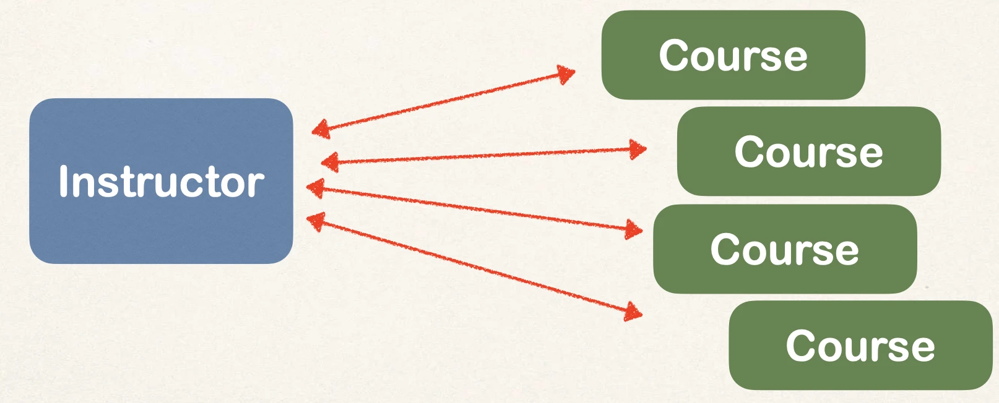
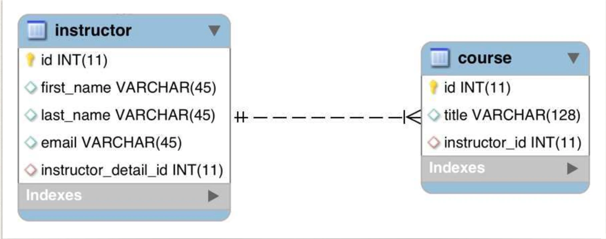

# @OneToMany - Overview - Part 1

## One-to-Many Mapping

- An instructor can have many courses
  - Bi-directional



## Many-to-One Mapping

- Many courses can have one instructor
  - Inverse / opposite of One-to-Many


## Real-World Project Requirement

Do not cascade deletes

- If you delete an instructor, DO NOT delete the courses
- If you delete a course, DO NOT delete the instructor

## Development Process: One-to-Many

1. Prep Work - Define database tables
2. Create Course class
3. Update Instructor class
4. Create Main App

## Step 1: Prep Work - Define database tables

### table: `course`

```sql
CREATE TABLE `course` (
  `id` int(11) NOT NULL AUTO_INCREMENT,
  `title` varchar(128) DEFAULT NULL,
  `instructor_id` int(11) DEFAULT NULL,

  PRIMARY KEY (`id`),
  UNIQUE KEY `TITLE_UNIQUE` (`title`), -- Prevent duplicate course titles

  KEY `FK_INSTRUCTOR_idx` (`instructor_id`),
  CONSTRAINT `FK_INSTRUCTOR`
  FOREIGN KEY (`instructor_id`)
  REFERENCES `instructor` (`id`)
);
```

### table: instructor - no changes



## Step 2: Create Course class

```java
@Entity
@Table(name="course")
public class Course {
    @Id
    @GeneratedValue(strategy=GenerationType.IDENTITY)
    @Column(name="id")
    private int id;

    @Column(name="title")
    private String title;

    @ManyToOne
    @JoinColumn(name="instructor_id")
    private Instructor instructor;

    // …
    // constructors, getters / setters
}
```
