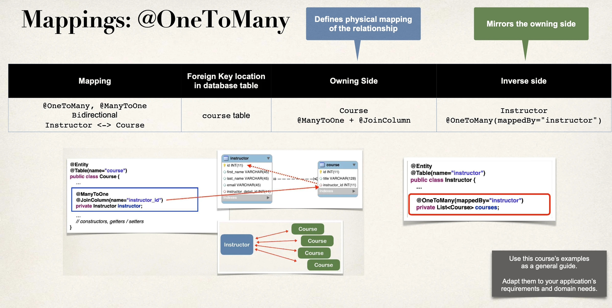

# @OneToMany - Overview - Part 2

## Step 3: Update Instructor - reference courses

```java
@Entity
@Table(name="instructor")
public class Instructor {
    // …

    // Refers to “instructor” property in “Course” class
    @OneToMany(mappedBy="instructor")
    private List<Course> courses;

    public List<Course> getCourses() {
        return courses;
    }

    public void setCourses(List<Course> courses) {
        this.courses = courses;
    }

    // …
}
```

## More: mappedBy

`mappedBy` tells Hibernate

- Look at the `instructor` property in the `Course` class
- Use information from the `Course` class `@JoinColumn`
- To help find associated courses for `instructor`

## Add support for Cascading

`Instructor` class:

```java
@Entity
@Table(name="instructor")
public class Instructor {
    // …

    // Do not apply cascading deletes!
    @OneToMany(mappedBy="instructor",
        cascade={CascadeType.PERSIST, CascadeType.MERGE
            CascadeType.DETACH, CascadeType.REFRESH})
    private List<Course> courses;

    // …
}
```

`Course` class:

```java
@Entity
@Table(name="course")
public class Course {
    // …

    // Do not apply cascading deletes!
    @ManyToOne(cascade={CascadeType.PERSIST, CascadeType.MERGE
          CascadeType.DETACH, CascadeType.REFRESH})
    @JoinColumn(name="instructor_id")
    private Instructor instructor;

    // …
    // constructors, getters / setters
}
```

## Add convenience methods for bi-directional

```java
@Entity
@Table(name="instructor")
public class Instructor {
    // …

    // add convenience methods for bi-directional relationship
    public void add(Course tempCourse) {

      if (courses == null) {
          courses = new ArrayList<>();
      }

      courses.add(tempCourse);
      tempCourse.setInstructor(this);
    }

    // …
}
```

## Recap


