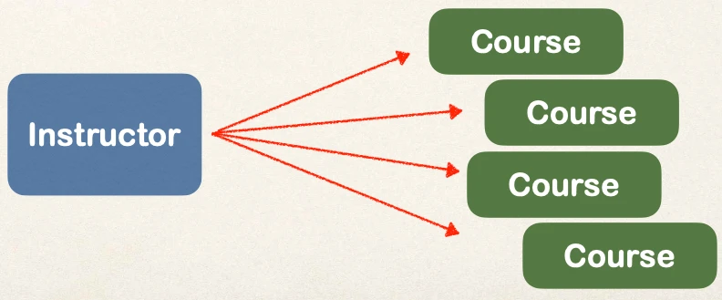
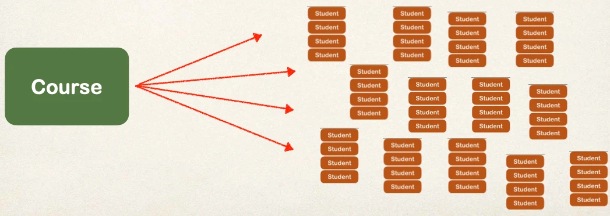
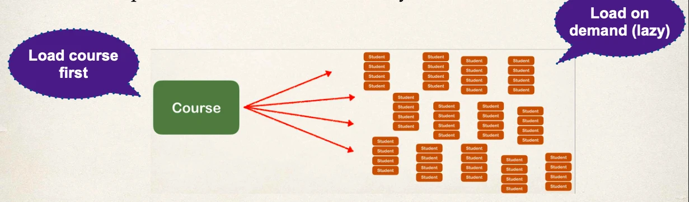

# @OneToMany - Fetch Types: Eager vs Lazy - Overview - Part 1

## Fetch Types: Eager vs Lazy Loading

When we fetch / retrieve data, should we retrieve EVERYTHING?

- _Eager_ will retrieve everything
- _Lazy_ will retrieve on request

## Eager Loading

Eager loading will load all dependent entities

- Load instructor and all of their courses at once

What about course and students?

- Could easily turn into a performance nightmare …

- In our app, if we are searching for a course by keyword
  - Only want a list of matching courses
- Eager loading would still **load all students** for **each course** …. not good!

## Best Practice

- Only load data when absolutely needed
- Prefer Lazy loading instead of Eager loading

## Lazy Loading

Lazy loading will load the main entity first

- Load dependent entities on demand (lazy)

