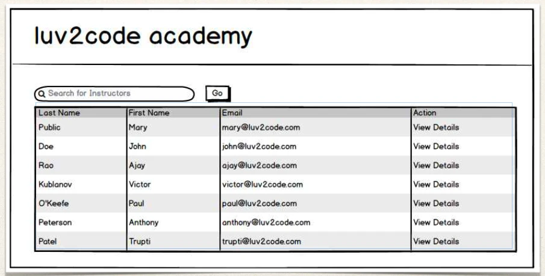
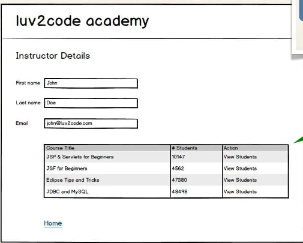

# @OneToMany - Fetch Types: Eager vs Lazy - Overview - Part 2

## Real-World Use Case

- Search for instructors



## Real-World Use Case

- In Master view, use lazy loading
- In Detail view, retrieve the entity and necessary dependent entities

## Real-World Use Case - Master View

- In Master view, use lazy loading for search results
- Only load instructors … not their courses


## Real-World Use Case - Detail View

- In Detail view, retrieve the entity and necessary dependent entities
- Load instructor AND their courses



## Fetch Type

- When you define the mapping relationship
- You can specify the fetch type: `EAGER` or `LAZY`

```java
@Entity
@Table(name="instructor")
public class Instructor {
    // …

    @OneToMany(fetch=FetchType.LAZY, mappedBy=“instructor”)
    private List<Course> courses;

    // …
}
```

## Default Fetch Types

| Mapping     | Default Fetch Type |
| ----------- | ------------------ |
| @OneToOne   | FetchType.EAGER    |
| @OneToMany  | FetchType.LAZY     |
| @ManyToOne  | FetchType.EAGER    |
| @ManyToMany | FetchType.LAZY     |

## Overriding Default Fetch Type

- Specifying the fetch type, overrides the defaults

```java
@ManyToOne(fetch=FetchType.LAZY)
@JoinColumn(name="instructor_id")
private Instructor instructor;
```

## More about Lazy Loading

- When you lazy load, the data is only retrieved on demand
- However, this requires an open Hibernate session
  - need an connection to database to retrieve data
- If the Hibernate session is closed
  - And you attempt to retrieve lazy data
  - Hibernate will throw an exception!!
