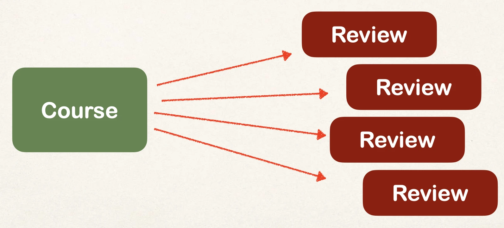
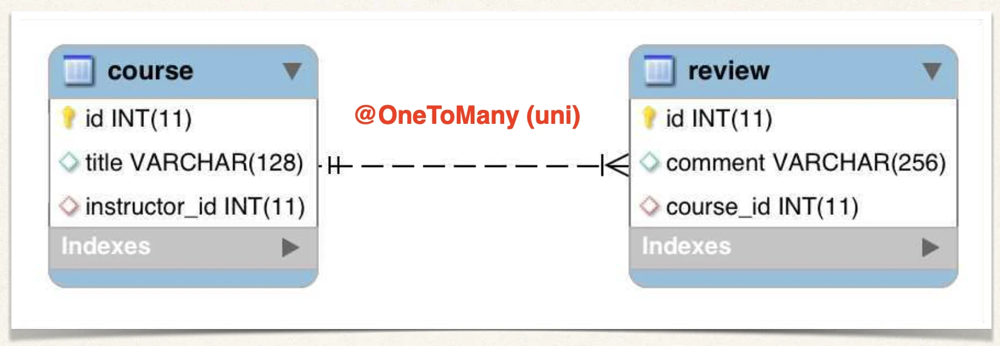
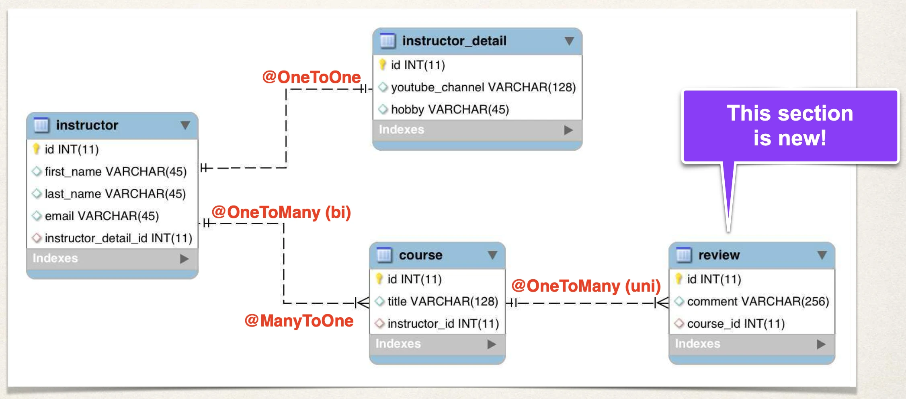
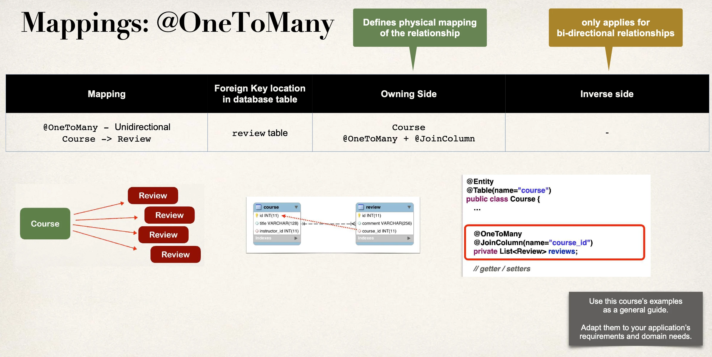

# @OneToMany - UniDirectional - Overview

## One-to-Many Mapping

- A course can have many reviews (Uni-directional)



## Real-World Project Requirement

- If you delete a course, also delete the reviews
- Reviews without a course … have no meaning

## @OneToMany



## Look Mom … our project is growing!



## Development Process: One-to-Many

1. Prep Work - Define database tables
2. Create `Review` class
3. Update `Course` class

## Step 1: table: review

- We'll create a reviews table

```sql
CREATE TABLE `review` (
  `id` int(11) NOT NULL AUTO_INCREMENT,
  `comment` varchar(256) DEFAULT NULL,
  `course_id` int(11) DEFAULT NULL,

  KEY `FK_COURSE_ID_idx` (`course_id`),
  CONSTRAINT `FK_COURSE`
  FOREIGN KEY (`course_id`)
  REFERENCES `course` (`id`)
);
```

- We won't need to update the courses table

## Step 2: Create Review class

```java
@Entity
@Table(name="review")
public class Review {

    @Id
    @GeneratedValue(strategy=GenerationType.IDENTITY)
    @Column(name="id")
    private int id;

    @Column(name="comment")
    private String comment;

    // …
    // constructors, getters / setters
}
```

## Step 3: Update Course

Reference reviews:

- `@JoinColumn(name="course_id")`: Refers to `course_id` column in `review` table

```java
@Entity
@Table(name="course")
public class Course {
    // …

    @OneToMany
    @JoinColumn(name="course_id")
    private List<Review> reviews;

    // getter / setters
    // …
}
```

#### More: @JoinColumn

In this scenario, `@JoinColumn` tells Hibernate

- Look at the `course_id` column in the `review` table
- Use this information to help find associated **reviews** for a **course**

#### Add support for Cascading

Cascade all operations including deletes!

```java
@Entity
@Table(name="course")
public class Course {
    // …

    @OneToMany(cascade=CascadeType.ALL)
    @JoinColumn(name="course_id")
    private List<Review> reviews;

    // …
}
```

#### Add support for Lazy loading

Lazy load the reviews

```java
@Entity
@Table(name="course")
public class Course {
    // …

    @OneToMany(fetch=FetchType.LAZY, cascade=CascadeType.ALL)
    @JoinColumn(name="course_id")
    private List<Review> reviews;

    // …
}
```

#### Add convenience method for adding reviews

```java
@Entity
@Table(name="course")
public class Course {
    // …

    // add convenience methods for adding reviews
    public void add(Review tempReview) {
        if (reviews == null) {
            reviews = new ArrayList<>();
        }

        reviews.add(tempReview);
    }
    // …
}
```

## Recap


