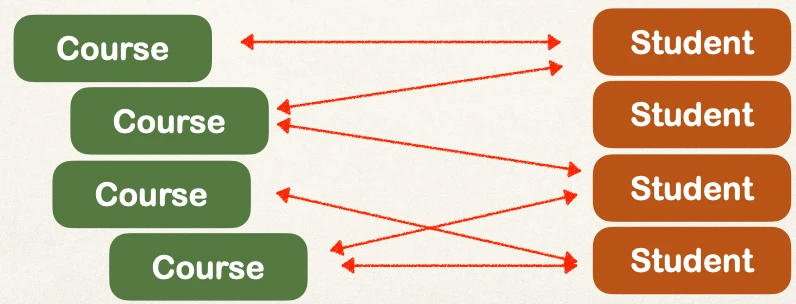
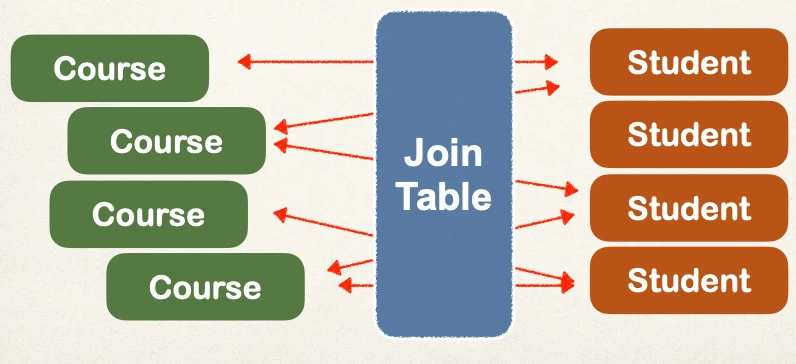
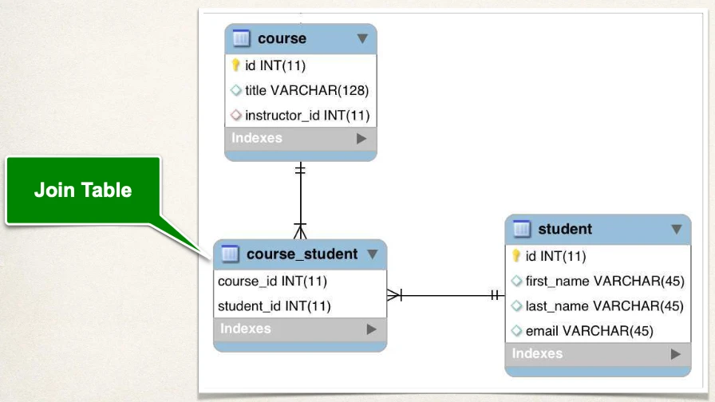
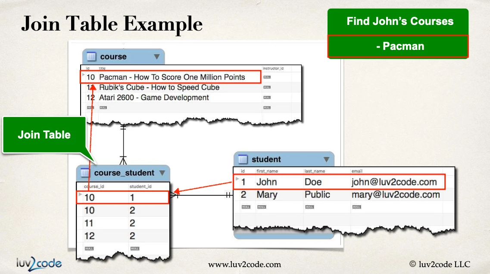
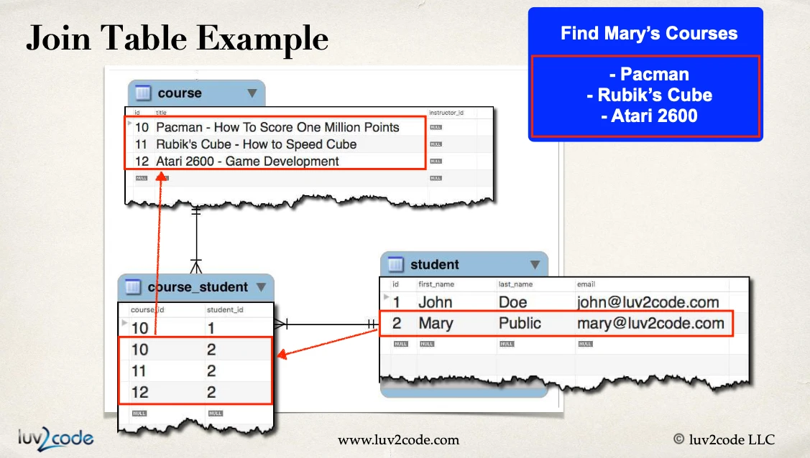
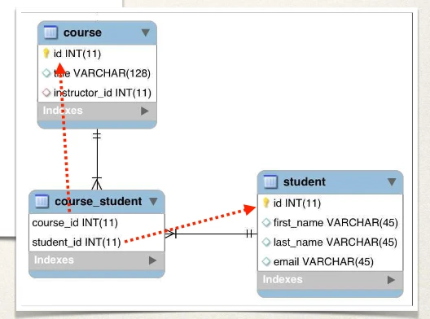

# @ManyToMany - Overview - Part 1

## Many-to-Many Mapping

- A course can have many students
- A student can have many courses



## Keep track of relationships

We some how need to keep track of who relates to what

- Need to track which student is in which course and vice-versa



## Join Table

- A table that provides a mapping between two tables.
- It has foreign keys for each table to define the mapping relationship.



### Example #1: Find John's Courses



### Example #2: Find Mary's courses



## Development Process: Many-to-Many

1. Prep Work - Define database tables
2. Update `Course` class
3. Update `Student` class

### join table: `course_student`

```sql
CREATE TABLE `course_student` (
  `course_id` int(11) NOT NULL,
  `student_id` int(11) NOT NULL,

  PRIMARY KEY (`course_id`, `student_id`),

  -- ...
);
```

with foreign keys:

```sql
CREATE TABLE `course_student` (
  `course_id` int(11) NOT NULL,
  `student_id` int(11) NOT NULL,

  PRIMARY KEY (`course_id`, `student_id`),

  CONSTRAINT `FK_COURSE_05`
  FOREIGN KEY (`course_id`)
  REFERENCES `course` (`id`),

  CONSTRAINT `FK_STUDENT`
  FOREIGN KEY (`student_id`)
  REFERENCES `student` (`id`)
  -- …
);
```


