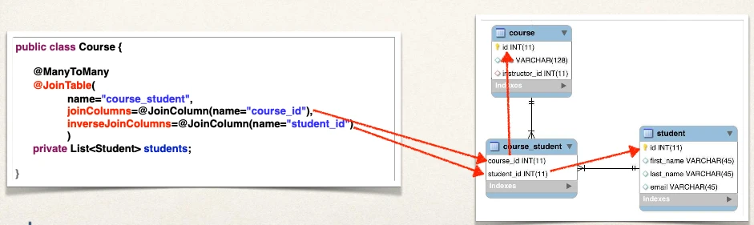
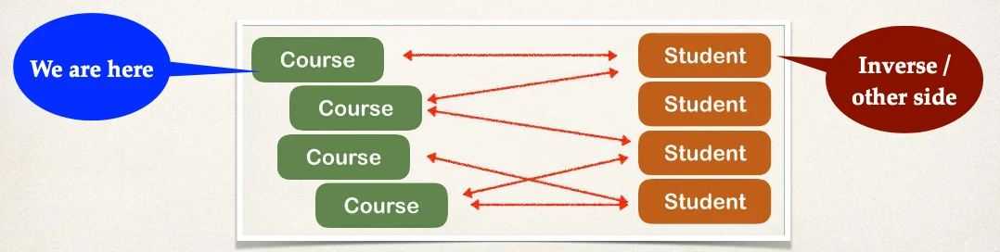
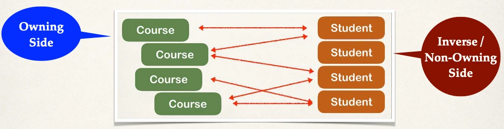
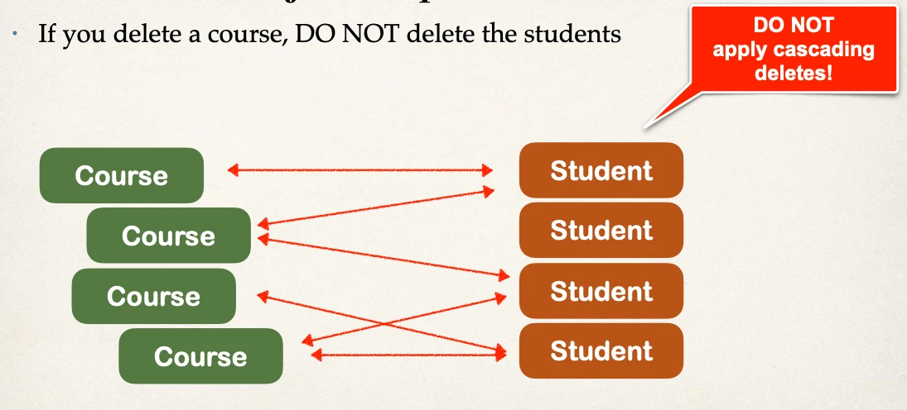
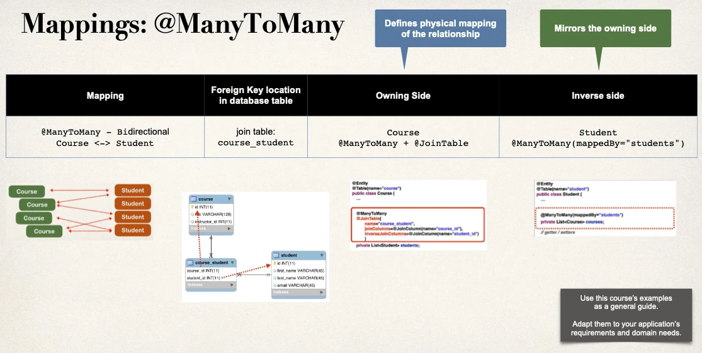

# @ManyToMany - Overview - Part 2

## Step 2: Update Course - reference students

```java
@Entity
@Table(name="course")
public class Course {
  // …

  private List<Student> students;
  // getter / setters

  // …
}
```

### Add @ManyToMany annotation

```java
@Entity
@Table(name="course")
public class Course {
    // ...

    @ManyToMany
    @JoinTable(
        name="course_student",
        joinColumns=@JoinColumn(name="course_id"),
        inverseJoinColumns=@JoinColumn(name="student_id")
    )
    private List<Student> students;

    // getter / setters
    // ...
}
```

- `joinColumns=@JoinColumn(name="course_id")`: Refers to `course_id` column in `course_student` join table
- `inverseJoinColumns=@JoinColumn(name="student_id")`: Refers to `student_id` column in `course_student` join table

## More: @JoinTable

`@JoinTable` tells Hibernate:

- Look at the `course_id` column in the `course_student` table
- For other side (inverse), look at the `student_id` column in the `course_student` table
- Use this information to find relationship between **course** and **students**



## More on “inverse”

- In this context, we are defining the relationship in the `Course` class
- The `Student` class is on the “other side” … so it is considered the “inverse”
- “Inverse” refers to the “other side” of the relationship



## Owning Side and Inverse / Non-Owning Side

Every many-to-many association has two sides:

- The owning side and the inverse / non-owning side

If the association is bidirectional

- Either side may be designated as the owning side
- The non-owning side must use the `mappedBy` element of the `ManyToMany` annotation
- To specify the relationship field or property of the owning side



**Now, let’s update the mapping for the Student**

## Step 3: Update Student - reference courses

```java
@Entity
@Table(name="student")
public class Student {
    // …

    @ManyToMany(mappedBy="students")
    private List<Course> courses;

    // getter / setters
    // …
}
```

- `@ManyToMany(mappedBy="students")`: Refers to `students` property in `Course` class

## More: `mappedBy`

`mappedBy` tells Hibernate

- Look at the `students` property in the `Course` class
- Use information from the `Course` class `@JoinTable`
- To help find associated courses for `student`

## Real-World Project Requirement

- If you delete a course, DO NOT delete the students



## Recap



## Other features

- In the next set of videos, we’ll add support for other features
- **Lazy Loading** of students and courses
- **Cascading** to handle cascading saves … but NOT deletes
  - If we delete a course, DO NOT delete students
  - If we delete a student, DO NOT delete courses
