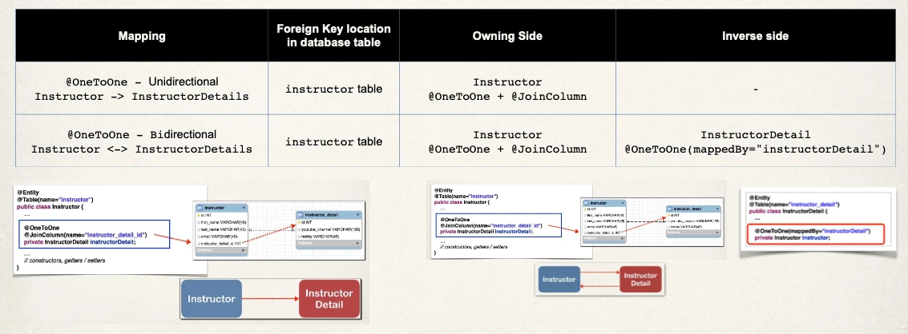
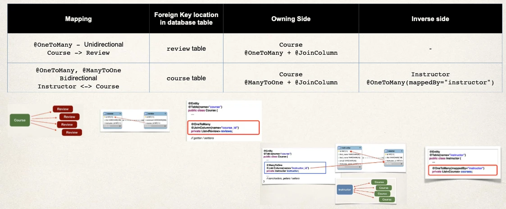
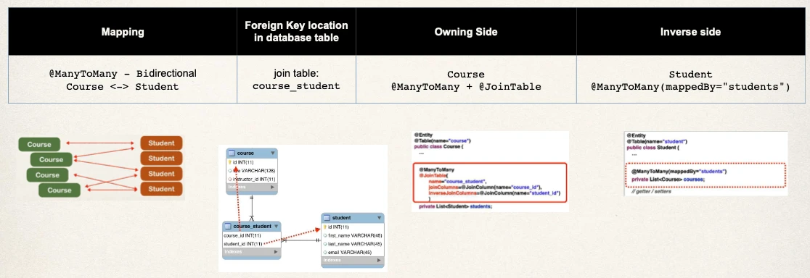

# Advanced Mappings Review Guide - Cheat Sheet

## Mappings - @OneToOne

## Mappings - @OneToMany

## Mappings - @ManyToMany

## Multiple Valid Designs

- For JPA/Hibernate relationships, this isn’t one “right” mapping
- JPA/Hibernate supports several ways to model
  - `@OneToOne`, `@OneToMany`/`@ManyToOne` and `@ManyToMany`
- You may find other solutions online with different approaches
- In this course,
  - Treat the examples as a general guide
  - Adapt when your application requirements and domain needs differ
