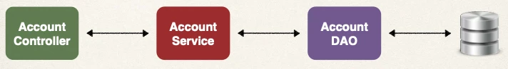
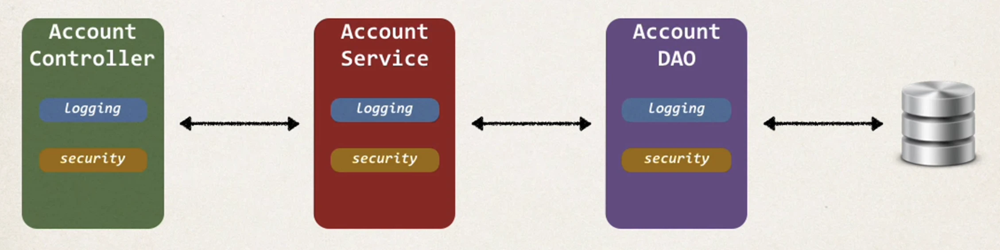
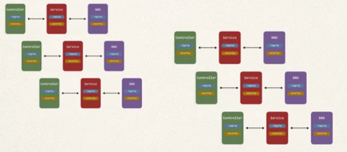

# AOP - The Business Problem

## Application Architecture



## Code for Data Access Object (DAO)

```java
public void addAccount(Account theAccount, String userId) {
    entityManager.persist(theAccount);
}
```

## New Requirement - Logging

- Need to add logging to our DAO methods
  - Add some logging statements before the start of the method
- Possibly more places … but get started on that ASAP!

### DAO - Add Logging Code

```java
public void addAccount(Account theAccount, String userId) {
    // logging code goes here
    entityManager.persist(theAccount);
}
```

## New Requirement - Security

- Need to add security code to our DAO
- Make sure user is authorized before running DAO method

### Add Security Code

```java
public void addAccount(Account theAccount, String userId) {
    // logging code goes here
    // security code goes here
    entityManager.persist(theAccount);
}
```

## By the way

The boss says:

- Let’s add it to all of our layers…



## I'm Going Crazy Over Here


