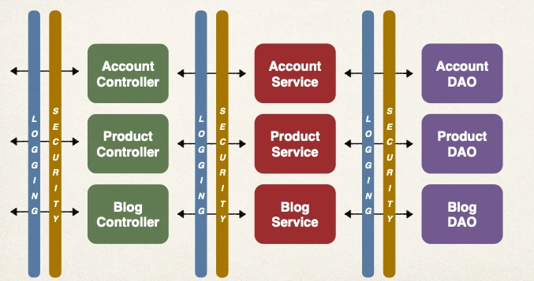
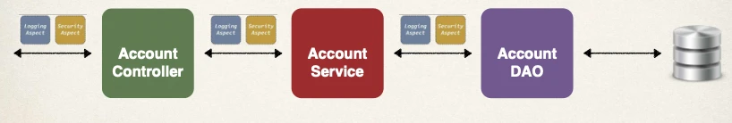

# AOP Solution and AOP Use Cases

## Two Main Problems

**Code Tangling**

- For a given method: `addAccount(…)`
- We have logging and security code tangled in

**Code Scattering**

- If we need to change logging or security code
- We have to update ALL classes

## Other possible solutions?

**Inheritance?**

- Every class would need to inherit from a base class
- Can all classes extends from your base class? … plus no multiple inheritance support in Java

**Delegation?**

- Classes would delegate logging, security calls
- Still would need to update classes if we wanted to
- add/remove logging or security
- add new feature like auditing, API management, instrumentation

## Aspect-Oriented Programming

**Cross-Cutting Concerns**

- Programming technique based on concept of an Aspect
- Aspect encapsulates cross-cutting logic
- “Concern” means logic / functionality

### Cross Cutting Concerns

## Aspects

- Aspect can be reused at multiple locations
- Same aspect/class … applied based on configuration

