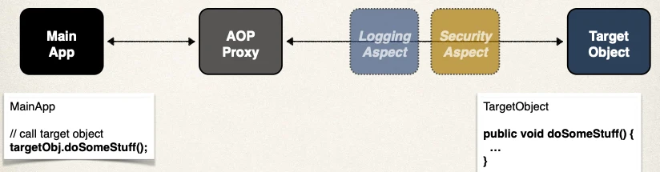
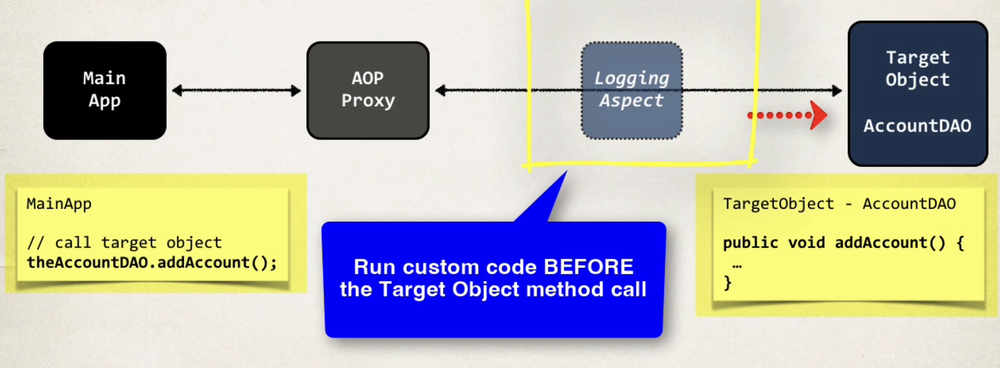

# AOP - @Befor Advice - Overview - Part 1

## Advice Types

- **Before advice**: run before the method 👈
- **After finally advice**: run after the method (finally)
- **After returning advice**: run after the method (success execution)
- **After throwing advice**: run after method (if exception thrown)
- **Around advice**: run before and after method

## @Before Advice - Interaction

Before the main app calls `targetObj.doSumeStuff`, we want to run custom code before the target object's method call.



## Advice - Interaction

```java
// Target Object
// @Before - Run custo code BEFORE the Target Object method call
public void doSomeStuff() {
  // ...
}
// @AfterReturning - Run custom code AFTER the method returns
```

## @Before Advice - Use Cases

**Most common**:

- logging, security, transactions

**Audit logging**:

- who, what, when, where

**API Management**:

- how many times has a method been called user
- analytics: what are peak times? what is average load? who is top user?

## AOP Example - Overview


