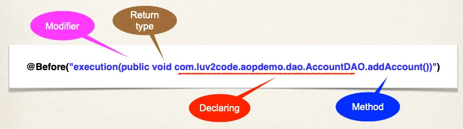
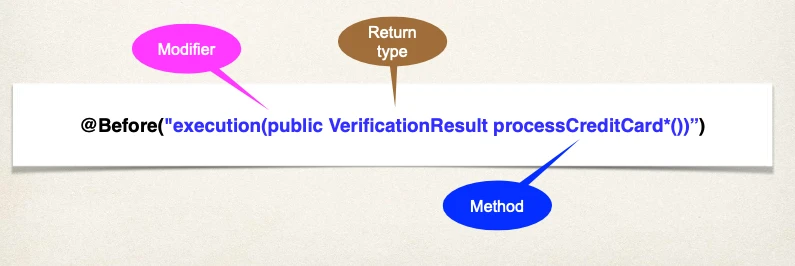
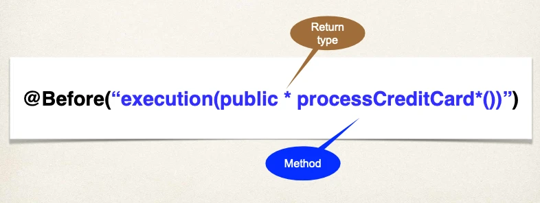
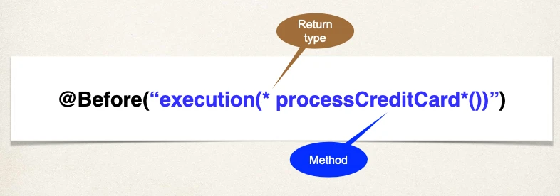

# AOP - Pointcut Expressions - Overview

## AOP Terminology

- **Pointcut**: A predicate expression for where advice should be applied

## Pointcut Expression Language

- Spring AOP uses AspectJ’s pointcut expression language
- We will start with **execution** pointcuts
  - Applies to **execution** of methods

## Match on Method Name

### Pointcut Expression Language

```
execution(modifiers-pattern? return-type-pattern declaring-type-pattern?
          method-name-pattern(param-pattern) throws-pattern?)
```

The pattern is optional if it has “?”:

- `modifiers-pattern?`: public, protected and (default/none: package-visible)
- `return-type-pattern`: void, boolean, String, `List<Customer>`, ...
- `declaring-type-pattern?`: the class name
- `method-name-pattern`: Method name to match
  - `(param-pattern)`: Parameter types to match
- `throws-pattern?`: Exception types to match

### Pointcut Expression Examples

#### Example #1

Match on method names

- Match only **addAccount()** method in **AccountDAO** class



#### Example #2

Match on method names

- Match any **addAccount()** method in **any** class


#### Example #3

Match on method names (using wildcards)

- Match methods **starting** with **add** in any class


#### Example #4

Match on method names (using wildcards)

- Match methods **starting** with **processCreditCard** in any class



#### Example #5

Use wildcards on return type:



#### Example #6

Modifier is optional … so you don’t have to list it


