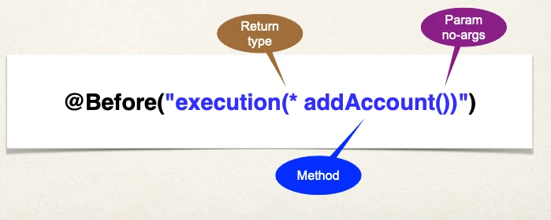
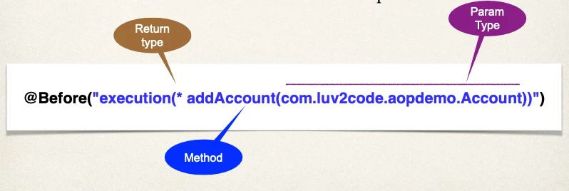
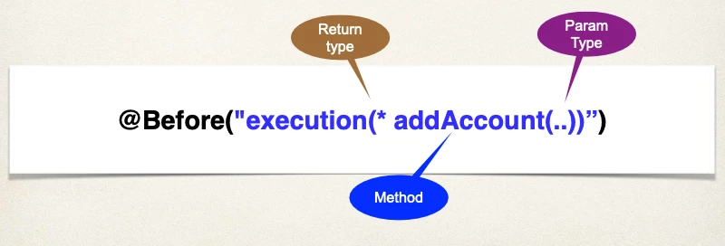
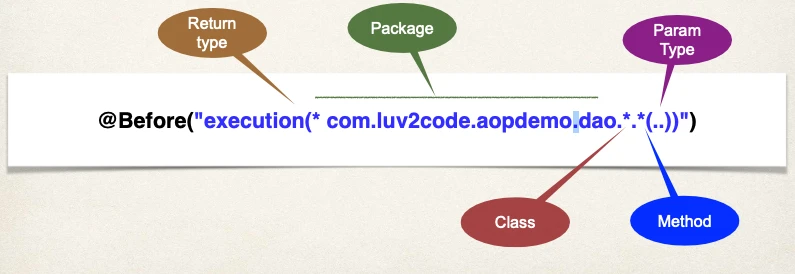

# AOP - Pointcut Expressions - Overview - Match on Method Parameters

## Match on Parameters

### Parameter Pattern Wildcards

For param-pattern:

- `()` - matches a method with no arguments
- `(*)` - matches a method with one argument of any type
- `(..)` - matches a method with 0 or more arguments of any type

### Pointcut Expression Examples

#### Example #1

Match on method _parameters_

- Match **addAccount** methods with **no arguments**



#### Example #2

Match on method _parameters_

- Match **addAccount** methods that have **Account** param



#### Example #3

Match on method _parameters_ (using wildcards)

- Match **addAccount** methods with **any number of arguments**



## Match on Package

### Package - Pointcut Expression Examples

Match on methods in a _package_

- Match any method in our DAO package: **com.karani.aopdemo.dao**



## If you are using IntelliJ Ultimate

You may encounter this error

```
Exception encountered during context initialization - cancelling refresh attempt:
org.springframework.beans.factory.BeanCreationException: Error
creating bean with name 'mbeanExporter' defined in class path
resource [org/springframework/boot/autoconfigure/jmx/JmxAutoConfiguration.class]
```

Why?

- IntelliJ Ultimate loads additional classes for JMX
- This conflicts with Spring Boot’s JMX Autoconfiguration

When using wildcards with AOP, caution should be taken.

- If new frameworks are added to your project, then you may encounter conflicts.
- Recommendation is to:
  - narrow your pointcut expressions
  - limit them to your project package

In this case, our pointcut expression is too broad. We can resolve this by:

- narrowing the pointcut expression
- only match within our project package

```java
@Before("execution(* com.karani..add*(..))")
```

- `com.karani..`: Narrow pointcut expression to our package
